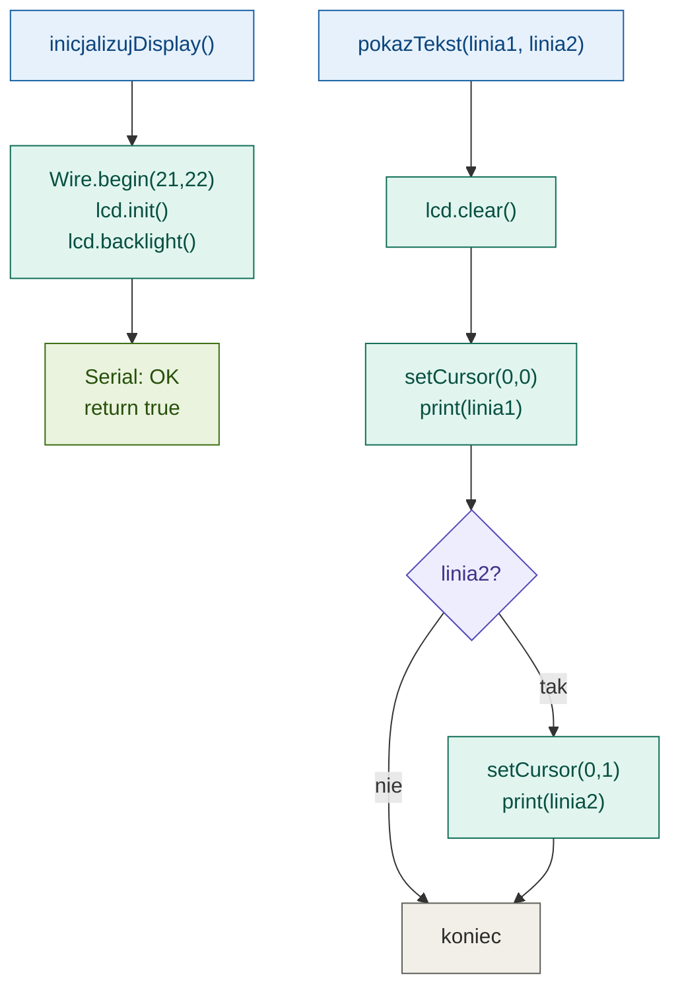
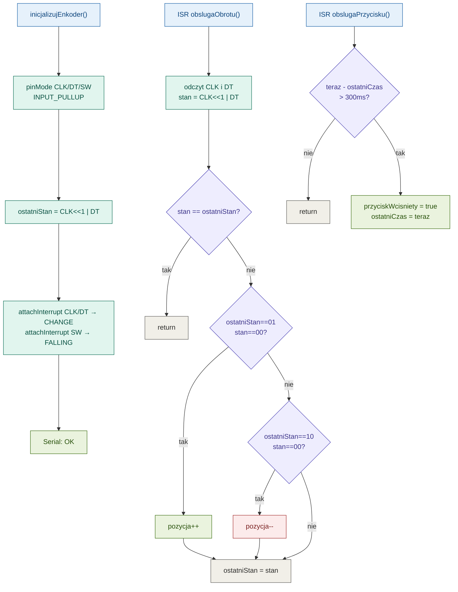
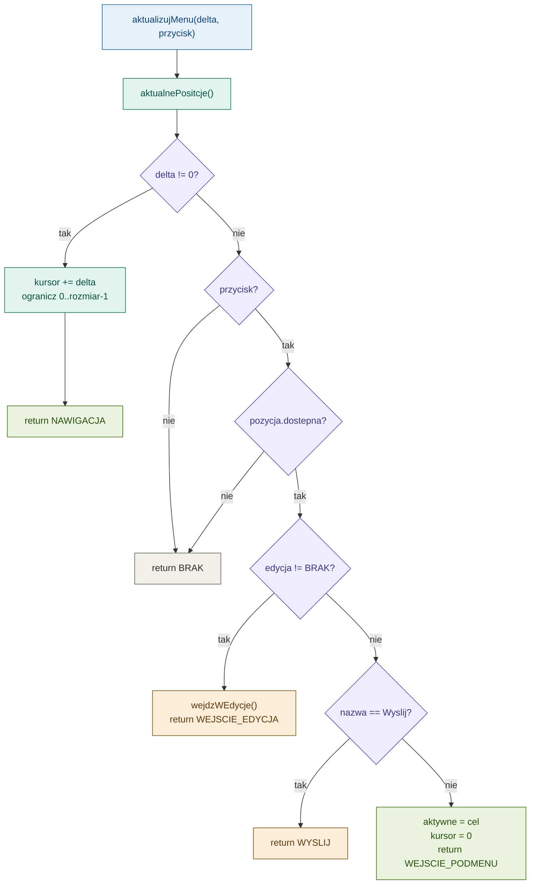
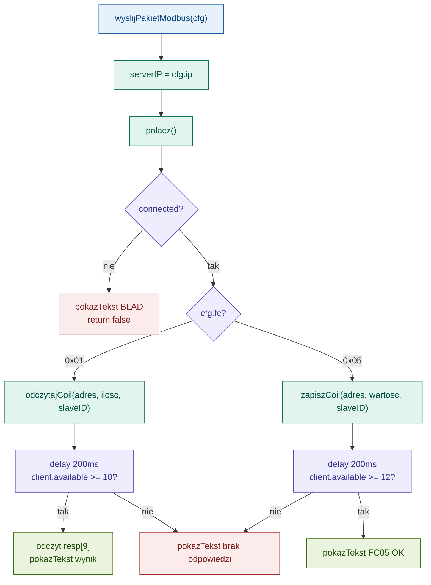

# ESP32 + W5500 + LCD + Enkoder — Modbus Tester

Narzędzie do testowania Modbus TCP — tryb Master i Slave, konfiguracja przez enkoder i wyświetlacz LCD.

---

## Podłączenie

### W5500 → ESP32 (VSPI)

| W5500 | ESP32   |
|-------|---------|
| MOSI  | GPIO 23 |
| MISO  | GPIO 19 |
| SCLK  | GPIO 18 |
| SCS   | GPIO 5  |
| 3.3V  | 3.3V    |
| GND   | GND     |

### LCD 1602A I2C → ESP32

| LCD  | ESP32   | Opis |
|------|---------|------|
| GND  | GND     | Masa |
| VCC  | VIN (5V)| Zasilanie |
| SDA  | GPIO 21 | Dane I2C |
| SCL  | GPIO 22 | Zegar I2C |

> **Ważne:** LCD wymaga **5V** — podłącz do pinu `VIN`, nie `3.3V`.

> **Ważne:** Ethernet (W5500) musi być inicjalizowany przed LCD — `Wire.begin()` po `Ethernet.begin()`.

### Enkoder → ESP32

| Enkoder | ESP32   | Opis |
|---------|---------|------|
| CLK     | GPIO 32 | Obrót A |
| DT      | GPIO 33 | Obrót B |
| SW      | GPIO 25 | Przycisk |
| +       | 3.3V    | Zasilanie |
| GND     | GND     | Masa |

---

## Konfiguracja IP

**`ip`** — adres który dostaje ESP32, np. `192.168.1.100`

**`serverIP`** — adres PC z Modbus Slave. Przy połączeniu bezpośrednim kablem ustaw statyczne IP na karcie sieciowej PC, np. `192.168.1.1`.

> Oba urządzenia muszą być w tej samej podsieci.

> **Modbus Slave:** ustaw konkretne IP (`192.168.1.1`) zamiast `Any Address` — ESP32 nie nawiązuje połączenia gdy Slave nasłuchuje na `Any Address`.

---

## Typy rejestrów Modbus

| Typ | Adres | Dostęp | Co trzyma? | Przykład |
|-----|-------|--------|------------|---------|
| **Coils** | 0x 00001+ | Odczyt + Zapis | Bit (0/1) | LED, przekaźnik |
| Discrete Inputs | 1x 10001+ | Tylko odczyt | Bit (0/1) | Przycisk, czujnik |
| Input Registers | 3x 30001+ | Tylko odczyt | Liczba 16-bit | Temperatura, ADC |
| Holding Registers | 4x 40001+ | Odczyt + Zapis | Liczba 16-bit | Setpoint, parametry |

---

## Plan etapów

- [x] Etap 1 — Modbus TCP Client, obsługa Coils
- [x] Etap 2 — LCD hello world
- [x] Etap 3 — Enkoder, odczyt obrotów i przycisku
- [x] Etap 4 — Menu nawigacja LCD + enkoder
- [x] Etap 5 — Konfiguracja IP, Port, Slave ID przez menu
- [x] Etap 6 — Integracja konfiguracji z Modbusem
- [ ] Etap 7 — Tryb Slave

---

## Etap 2 — LCD

Moduł `src/display/` obsługuje wyświetlacz LCD 1602A przez I2C.

> Zamieniono OLED SSD1306 SPI na LCD 1602A I2C — SPI OLEDa kolidowało z magistralą W5500 podczas nawiązywania połączenia TCP.



---

## Etap 3 — Enkoder

Moduł `src/encoder/` obsługuje enkoder obrotowy z przyciskiem przez przerwania (interrupts).

> **Ważne:** Oba piny CLK i DT mają przerwania na `CHANGE` — algorytm sprawdza kombinację obu stanów co eliminuje skoki pozycji. Przycisk ma debouncing 300ms.



---

## Etap 4 — Menu

Moduł `src/menu/` obsługuje nawigację — obrót góra/dół, przycisk = wejdź/zatwierdź.

Na start zaimplementowana tylko ścieżka **Master → Coils**. Slave widoczny w menu ale oznaczony jako `wkrótce`.

### Typy danych (`menu.h`)

| Typ | Opis |
|-----|------|
| `TypMenu` | Enum — identyfikator aktywnego podmenu |
| `TrybEdycji` | Enum — który parametr jest edytowany |
| `WynikMenu` | Enum — wynik aktualizacji menu (nawigacja / edycja / podmenu / wyślij) |
| `PozycjaMenu` | Jeden wiersz na LCD — nazwa, cel, dostępność, tryb edycji |
| `KonfiguracjaMaster` | Parametry: IP, Port, Slave ID, FC, adres, wartość |
| `StanMenu` | Aktualny stan — aktywne podmenu, kursor, konfiguracja |

### Struktura menu

```
[Główne menu]
├── Master
│   ├── Połączenie
│   │   ├── IP serwera
│   │   ├── Port
│   │   └── Slave ID
│   └── Pakiet
│       ├── Function Code
│       ├── Adres rejestru
│       ├── Wartość
│       └── Wyślij
└── Slave                        ← wkrótce
```

### Sterowanie

| Akcja | Efekt |
|-------|-------|
| Obrót w prawo | Następna pozycja |
| Obrót w lewo | Poprzednia pozycja |
| Przycisk | Wejdź głębiej / zatwierdź |



---

## Etap 5 — Konfiguracja

Moduł `src/config/` obsługuje edycję wartości przez enkoder i formatowanie ich na LCD.

### Sterowanie podczas edycji

| Akcja | Efekt |
|-------|-------|
| Obrót | Zmień wartość (+1 / -1) |
| Przycisk | Zatwierdź i przejdź dalej (IP: następny oktet) |

---

## Etap 6 — Integracja Modbus

Moduł `src/app/` łączy konfigurację z menu z wysyłaniem pakietów Modbus TCP.

Po wybraniu "Wyślij" w menu — parametry z `KonfiguracjaMaster` trafiają do funkcji Modbus.



---

## Etap 7 — Tryb Slave

> *do uzupełnienia*

### Znane problemy do rozwiązania

1. **Edycja IP na LCD 1602A** — wprowadzanie adresu IP przez enkoder nie działa poprawnie na nowym wyświetlaczu. Do zbadania i naprawy.

2. **Przyczyna problemu z SPI** — możliwe że OLED SPI nie był przyczyną braku połączenia. Problem mógł leżeć po stronie Modbus Slave który był skonfigurowany na `Any Address` zamiast konkretnego IP `192.168.1.1`. Do weryfikacji czy stary OLED SSD1306 działa poprawnie po ustawieniu stałego IP w Modbus Slave.