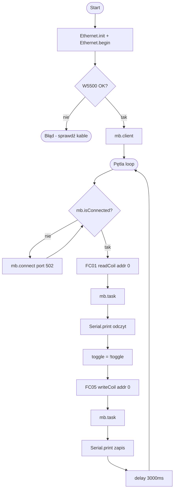

# ESP32 + W5500 — Modbus TCP Client

---

## Podłączenie W5500 → ESP32

| W5500 | ESP32   |
|-------|---------|
| MOSI  | GPIO 23 |
| MISO  | GPIO 19 |
| SCLK  | GPIO 18 |
| SCS   | GPIO 5  |
| 3.3V  | 3.3V    |
| GND   | GND     |

## Typy rejestrów Modbus

| Typ | Adres | Dostęp | Co trzyma? | Przykład |
|-----|-------|--------|------------|---------|
| **Coils** | 0x 00001+ | Odczyt + Zapis | Bit (0/1) | LED, przekaźnik |
| Discrete Inputs | 1x 10001+ | Tylko odczyt | Bit (0/1) | Przycisk, czujnik |
| Input Registers | 3x 30001+ | Tylko odczyt | Liczba 16-bit | Temperatura, ADC |
| Holding Registers | 4x 40001+ | Odczyt + Zapis | Liczba 16-bit | Setpoint, parametry |

---

## Diagram działania kodu — Coils

