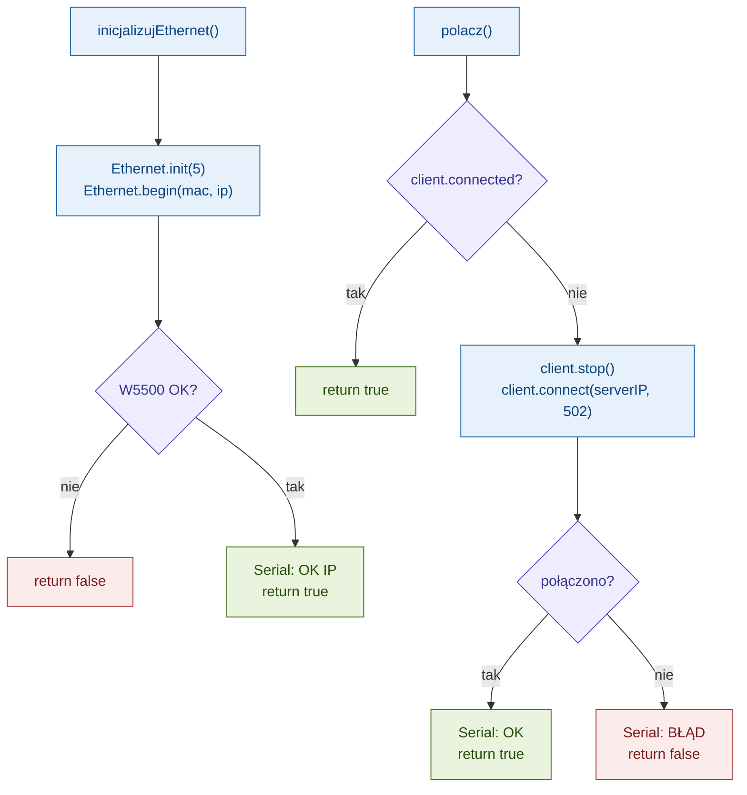
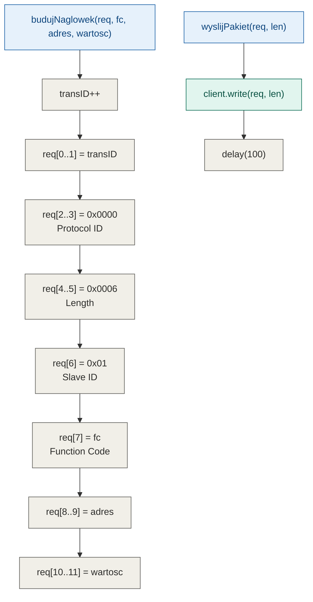
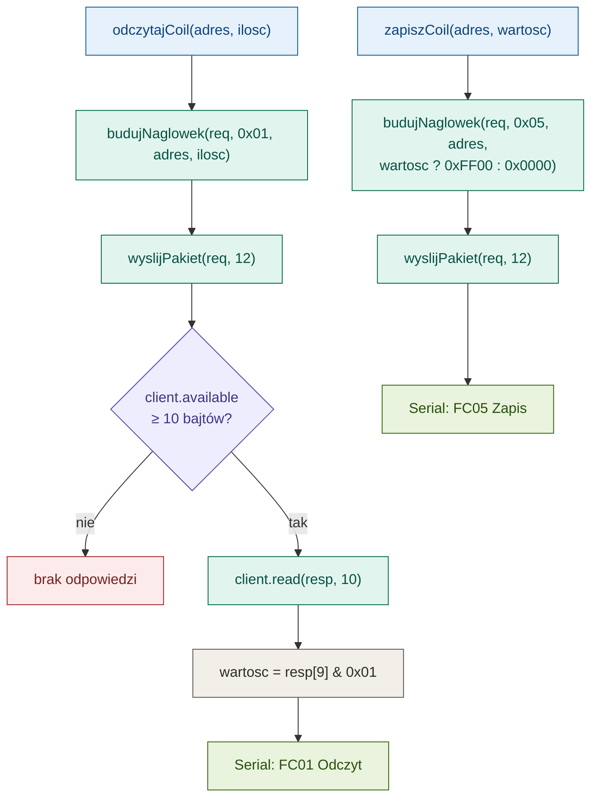
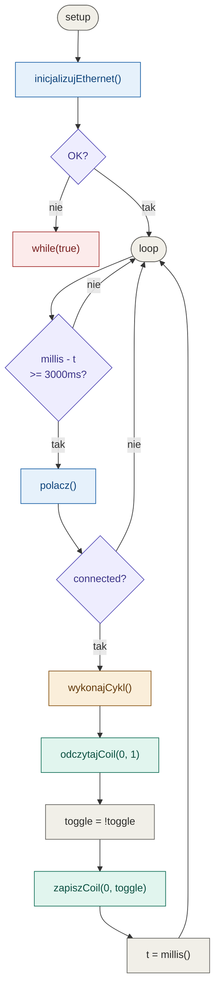
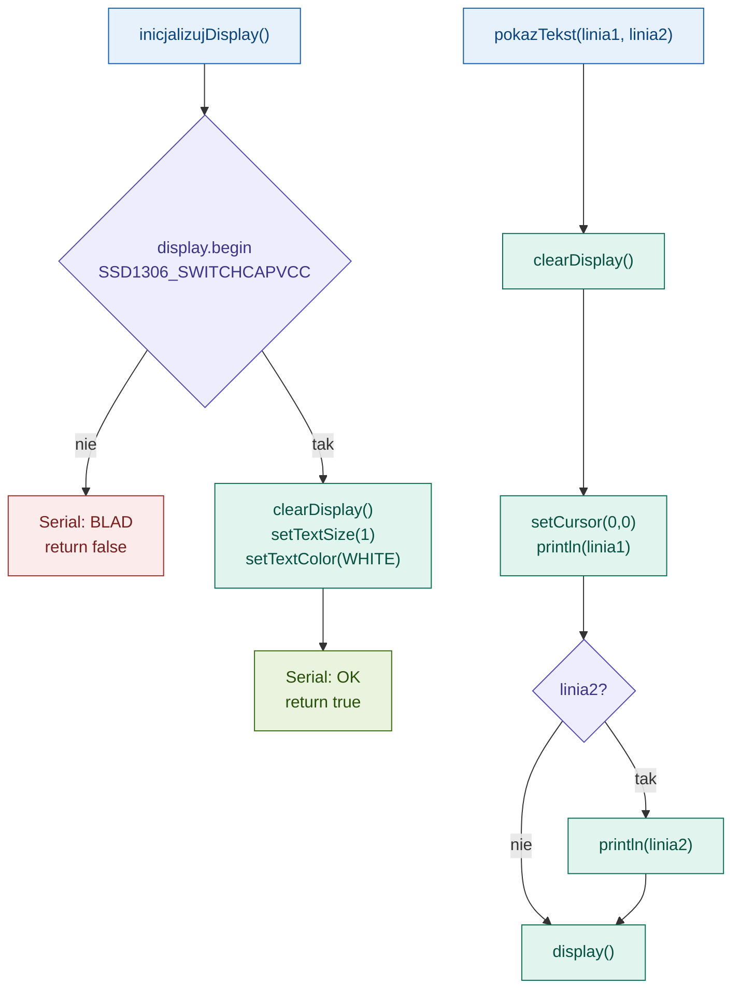

# ESP32 + W5500 - Modbus TCP Client

## Podłączenie W5500 → ESP32

| W5500 | ESP32   |
|-------|---------|
| MOSI  | GPIO 23 |
| MISO  | GPIO 19 |
| SCLK  | GPIO 18 |
| SCS   | GPIO 5  |
| 3.3V  | 3.3V    |
| GND   | GND     |

---

## Konfiguracja IP

**`ip`** — adres który dostaje ESP32, np. `192.168.1.100`

**`serverIP`** — adres PC z Modbus Slave. Przy połączeniu bezpośrednim kablem ustaw statyczne IP na karcie sieciowej PC, np. `192.168.1.1`.

> Oba urządzenia muszą być w tej samej podsieci.

---

## Typy rejestrów Modbus

| Typ | Adres | Dostęp | Co trzyma? | Przykład |
|-----|-------|--------|------------|---------|
| **Coils** | 0x 00001+ | Odczyt + Zapis | Bit (0/1) | LED, przekaźnik |
| Discrete Inputs | 1x 10001+ | Tylko odczyt | Bit (0/1) | Przycisk, czujnik |
| Input Registers | 3x 30001+ | Tylko odczyt | Liczba 16-bit | Temperatura, ADC |
| Holding Registers | 4x 40001+ | Odczyt + Zapis | Liczba 16-bit | Setpoint, parametry |

Uczymy się po jednym typie — zaczynamy od **Coils**.

---

## Struktura projektu

```
src/
├── main.cpp
├── network/
│   ├── ethernet.h
│   └── ethernet.cpp
├── modbus/
│   ├── modbus_tcp.h
│   ├── modbus_tcp.cpp
│   ├── coils.h
│   └── coils.cpp
└── app/
    ├── app.h
    └── app.cpp
```

---

## Diagram — `network/ethernet`

Inicjalizacja W5500 i zarządzanie połączeniem TCP.



---

## Diagram — `modbus/modbus_tcp`

Budowanie nagłówka MBAP i wysyłanie pakietu TCP.



---

## Diagram — `modbus/coils`

Odczyt (FC01) i zapis (FC05) pojedynczego Coil.



---

## Diagram — `app/app` + `main`

Logika aplikacji i główna pętla.



# ESP32 + W5500 + OLED + Enkoder — Modbus Tester

Narzędzie do testowania Modbus TCP — tryb Master i Slave, konfiguracja przez enkoder i wyświetlacz OLED.

---

## Podłączenie

### W5500 → ESP32 (VSPI)

| W5500 | ESP32   |
|-------|---------|
| MOSI  | GPIO 23 |
| MISO  | GPIO 19 |
| SCLK  | GPIO 18 |
| SCS   | GPIO 5  |
| 3.3V  | 3.3V    |
| GND   | GND     |

### OLED SSD1306 → ESP32 (HSPI)

| OLED | ESP32   | Opis |
|------|---------|------|
| GND  | GND     | Masa |
| VCC  | 3.3V    | Zasilanie |
| D0   | GPIO 14 | Zegar SPI |
| D1   | GPIO 13 | Dane |
| RES  | GPIO 26 | Reset |
| DC   | GPIO 27 | Data/Command |
| CS   | GPIO 15 | Chip Select |

### Enkoder → ESP32

| Enkoder | ESP32   | Opis |
|---------|---------|------|
| CLK     | GPIO 32 | Obrót A |
| DT      | GPIO 33 | Obrót B |
| SW      | GPIO 25 | Przycisk |
| +       | 3.3V    | Zasilanie |
| GND     | GND     | Masa |

---

## Plan etapów

- [x] Etap 1 — Modbus TCP Client, obsługa Coils
- [x] Etap 2 — OLED hello world
- [ ] Etap 3 — Enkoder, odczyt obrotów i przycisku
- [ ] Etap 4 — Menu nawigacja OLED + enkoder
- [ ] Etap 5 — Konfiguracja IP, Port, Slave ID przez menu
- [ ] Etap 6 — Integracja konfiguracji z Modbusem
- [ ] Etap 7 — Tryb Slave

---

## Etap 2 — OLED

Moduł `src/display/` obsługuje wyświetlacz SSD1306 przez SPI (HSPI).

> **Ważne:** OLED musi być inicjalizowany przed Ethernetem (W5500) — oba używają SPI i W5500 blokuje magistralę jeśli wystartuje pierwszy.



---

## Etap 3 — Enkoder

> *do uzupełnienia*

---

## Etap 4 — Menu

> *do uzupełnienia*

---

## Etap 5 — Konfiguracja

> *do uzupełnienia*

---

## Etap 6 — Integracja Modbus

> *do uzupełnienia*

---

## Etap 7 — Tryb Slave

> *do uzupełnienia*